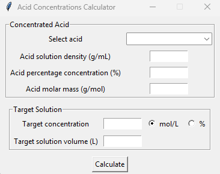

## General info

<u>Available acids:</u> Nitric acid (HNO3), Hydrochloric acid (HCl), Sulfuric acid (H2SO4), Acetic acid (CH3COOH), Formic acid (HCOOH), Phosphoric acid (H3PO4).

<u>Data source:</u> https://pl.wikibooks.org/wiki/Aneks/G%C4%99sto%C5%9B%C4%87_i_sk%C5%82ad_procentowy_roztwor%C3%B3w.

<b>Warning!!</b> Currently the results are accurate only for 20°C. Please keep this in mind as it might generate some error when you prepare solutions in different temperatures. 

## Why use the calculator?
Say you're an analytical chemist and you want to prepare an acid solution. You have a rough idea of the required volume and know the target concentration. However, the only available acids are in their original concentrated forms. This calculator helps you quickly determine how much acid to measure before diluting it in a volumetric flask.

## How to use the calculator? 
<b>Step 1</b>: Simply clone the code in <u>calculator.py</u> and run it in your console or IDE. The window should pop up right away.

<b>Step 2</b>: In the "Concentrated Acid" section, select the acid.

<b>Step 3 (optional)</b>: Adjust the density, percentage concentration, and molar mass based on the information from the acid bottle label or another source.  

<b>Step 4</b>: In the "Target Solution" section, enter the desired concentration of your diluted solution. Select whether the concentration is in g/mol or % using the corresponding radio button on the right.

<b>Step 5</b>: Enter the target solution volume (in liters) and click "Calculate". A new window will display the procedure for preparing the acid solution.

## How does it work?
First, based on the *acid solution density (**d_init**)*, *acid percentage concentration (**Cp_init**)* and *acid molar mass (**M**)* input values from the "Concentrated Acid" section the program calculates the *initial molar concentration (**Cm_init**)*. For this purpose the **calculate_initial_molar_concentration(Cp_init, d_init, M)** method is used.

Second step depends on the target concentration type selected in the "Target Solution" section.\
In case the *target concentration* is in mol/L (**Cm_target**, default option), the program:
1. makes sure that Cm_target < Cm_init.
2. calculates the *initial volume of the concentrated acid (**V_init**)* that needs to be measured using the **calculate_concentrated_acid_volume_from_molar_concentration(Cm_target, V_target, M, Cp_init, d_init)** method. This value is then displayed in the resulting window as part of the procedure.

In case the *target concentration* is in % **(Cp_target)**, the program:
1. makes sure that Cp_target < Cp_init.
2. calculates the *density of the target solution (**d_target**)* using the **calculate_acid_density(acid_name, Cp_target)** method.
3. calculates V_init using the **calculate_concentrated_acid_volume_from_percentage_concentration(Cp_target, d_target, V_target, Cp_init, d_init)** method. This value is then displayed in the resulting window as part of the procedure.

All the above-mentioned methods are in the CalculatorModel class in calculator.py.

### Formulae rearrangements:
**calculate_initial_molar_concentration(Cp_init, d_init, M)**:

$$ d_{sol} = \frac{m_{sol}}{V_{sol}} \implies m_{sol} = d_{sol} \cdot V_{sol} $$

$$ C_p = \frac{m_{a}}{m_{sol}} \cdot 100\% \implies m_a = \frac{C_p \cdot m_{sol}}{100\%} = \frac{C_p \cdot d_{sol} \cdot V_{sol}}{100\%} $$

$$ M = \frac{m_a}{n} \implies n = \frac{m_a}{M} = \frac{C_p \cdot d_{sol} \cdot V_{sol}}{M \cdot 100\%} $$

$$ C_m = \frac{n}{V_{sol}} = \frac{C_p \cdot d_{sol} \cdot \cancel{V_{sol}}}{\cancel{V_{sol}} \cdot M \cdot 100\%} = \frac{C_p \cdot d_{sol}}{M \cdot 100\%}$$

$$ [C_m] = \frac{\% \cdot \frac{g}{mL}}{\frac{g}{mol} \cdot \%} = \frac{mol}{mL} = 1000 \frac{mol}{L} $$

**$$ C_m = 1000 \frac{C_p \cdot d_{sol}}{M \cdot 100\%} [\frac{mol}{L}] $$**

where $C_p$ = Cp_init, $d_{sol}$ = d_init, $M$ = M 

**calculate_concentrated_acid_volume_from_molar_concentration(Cm_target, V_target, M, Cp_init, d_init)**:

$$ C_m = \frac{n}{V_{sol}} \implies n = C_m \cdot V_{sol} $$

$$ M = \frac{m_a}{n} \implies m_a = n \cdot M =  C_m \cdot V_{sol} \cdot M $$

$$ C_p = \frac{m_{a}}{m_{sol}} \cdot 100\% \implies m_{sol} = \frac{m_a \cdot 100\%}{C_p} = \frac{C_m \cdot V_{sol} \cdot M \cdot 100\%}{C_p} $$

$$ d_{sol} = \frac{m_{sol}}{V_{sol}} \implies V_{sol} = \frac{m_{sol}}{d_{sol}} = \frac{C_m \cdot V_{sol} \cdot M \cdot 100\%}{d_{sol} \cdot C_p} $$

$$ [V_{sol}] = \frac{\frac{mol}{L} \cdot L \cdot \frac{g}{mol} \cdot \%}{\frac{g}{mL} \cdot \%} = mL $$

**$$ V_{sol} = \frac{C_m \cdot V_{sol} \cdot M \cdot 100\%}{d_{sol} \cdot C_p} [mL] $$**

where $C_m$ = Cm_target, $V_{sol}$ = V_target, $M$ = M, $d_{sol}$ = d_init, $C_p$ = Cp_init 

**calculate_acid_density(acid_name, Cp_target)**:

$$ d_{sol} = a_1C_p^6 + a_2C_p^5 + a_3C_p^4 + a_4C_p^3 + a_5C_p^2 + a_6C_p + A $$

$$ or $$

$$ d_{sol} = aC_p + A $$

where $C_p$ = Cp_target

**calculate_concentrated_acid_volume_from_percentage_concentration(Cp_target, d_target, V_target, Cp_init, d_init)**:

target solution:

$$ d_{sol1} = \frac{m_{sol1}}{V_{sol1}} \implies m_{sol1} = d_{sol1} \cdot V_{sol1} $$

$$ C_{p1} = \frac{m_{a1}}{m_{sol1}} \cdot 100\% \implies m_{a1} = \frac{C_{p1} \cdot m_{sol1}}{100\%} = \frac{C_{p1} \cdot d_{sol1} \cdot V_{sol1}}{100\%} $$

initial solution:

$$ C_{p2} = \frac{m_{a2}}{m_{sol2}} \cdot 100\% \implies m_{sol2} = \frac{m_{a2} \cdot 100\%}{C_{p2}} $$

combined:

$$ m_{a2} = m_{a1} $$

$$ m_{sol2} = \frac{m_{a1} \cdot 100\%}{C_{p2}} = \frac{C_{p1} \cdot d_{sol1} \cdot V_{sol1} \cdot \cancel{100\%}}{\cancel{100\%} \cdot C_{p2}} = \frac{C_{p1} \cdot d_{sol1} \cdot V_{sol1}}{C_{p2}} $$

$$ d_{sol2} = \frac{m_{sol2}}{V_{sol2}} \implies V_{sol2} = \frac{m_{sol2}}{{d_{sol2}}} $$

$$ V_{sol2} = \frac{C_{p1} \cdot d_{sol1} \cdot V_{sol1}}{d_{sol2} \cdot C_{p2}} $$

$$ [V_{sol2}] = \frac{\% \cdot \frac{g}{mL} \cdot L}{\frac{g}{mL} \cdot \%} = L = 1000 mL $$

$$ V_{sol2} = 1000 \frac{C_{p1} \cdot d_{sol1} \cdot V_{sol1}}{d_{sol2} \cdot C_{p2}} [mL] $$

where $C_{p1}$ = Cp_target, $d_{sol1}$ = d_target, $V_{sol1}$ = V_target, $d_{sol2}$ = d_init, $C_{p2}$ = Cp_init